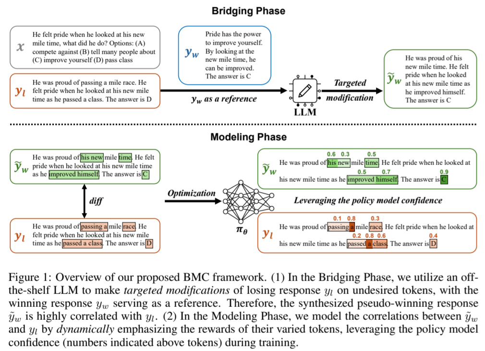

# Bridging and Modeling Correlations in Pairwise Data for Direct Preference Optimization

Direct preference optimization (DPO), a widely adopted offline preference optimization algorithm, aims to align large language models (LLMs) with humandesired behaviors using pairwise preference data. **However, the winning response and the losing response within pairwise data are generated isolatedly, leading to weak correlations between them as well as suboptimal alignment performance.** To address this issue, we propose an effective framework named BMC, for bridging and modeling correlations in pairwise data. 

- Firstly, we increase the consistency and informativeness of the pairwise preference signals through _targeted modifications_, synthesizing a pseudo-winning response by improving the losing response with the winning response as a reference.
- Secondly, we identify that DPO alone is insufficient to model these correlations and capture nuanced variations. Therefore, we propose learning token-level correlations by _dynamically_ leveraging the policy model’s confidence during training.

<p align="center">
    <br>
    
    <br>
</p>


## 🔍 Table of Contents
  - [⚙️ Install Requirements](#install-requirements)
  - [💻 Training Scripts](#training-scripts)
  - [💹 Evaluation](#evaluation)
  - [📝 Citation](#citation)


## ⚙️ Install Requirements

Our codebase is built upon the [alignment-handbook repo](https://github.com/huggingface/alignment-handbook). The following steps will guide you through the installation process.

First, create a Python virtual environment using e.g. Conda:
```shell
conda create -n handbook python=3.10 && conda activate handbook
```

Next, install PyTorch `v2.2.2`. Since this is hardware-dependent, we
direct you to the [PyTorch Installation Page](https://pytorch.org/get-started/locally/).

You can then install the remaining package dependencies of [alignment-handbook](https://github.com/huggingface/alignment-handbook) as follows:

```shell
git clone https://github.com/huggingface/alignment-handbook.git
cd ./alignment-handbook/
python -m pip install .
```

You will also need Flash Attention 2 installed, which can be done by running:

```shell
python -m pip install flash-attn --no-build-isolation
```

Finally, install other required packages:
```shell
pip install -r requirements.txt
```

## 💻 Training Scripts
We provide training config files for the three setups including question answering, mathematical reasoning, and instruction following. The training config is set for 4xA800 GPUs. You may need to adjust `num_processes` and `per_device_train_batch_size` based on your computation environment. 

### Question Answering
* Llama-2-7B-Base (SFT):
```shell
ACCELERATE_LOG_LEVEL=info accelerate launch --config_file accelerate_configs/deepspeed_zero3.yaml scripts/run_sft.py training_configs/question_answering/llama-2-7b-base-sft.yaml
```
* Llama-2-7B-Base (DPO-BMC):
```shell
ACCELERATE_LOG_LEVEL=info accelerate launch --config_file accelerate_configs/deepspeed_zero3.yaml scripts/run_dpo_bmc.py training_configs/question_answering/llama-2-7b-base-dpo-bmc.yaml
```
### Mathematical Reasoning
* Llama-2-7B-Base (SFT):
```shell
ACCELERATE_LOG_LEVEL=info accelerate launch --config_file accelerate_configs/deepspeed_zero3.yaml scripts/run_sft.py training_configs/math/llama-2-7b-base-sft.yaml
```
* Llama-2-7B-Base (DPO-BMC):
```shell
ACCELERATE_LOG_LEVEL=info accelerate launch --config_file accelerate_configs/deepspeed_zero3.yaml scripts/run_dpo_bmc.py training_configs/math/llama-2-7b-base-dpo-bmc.yaml
```
### Insturction Following
* Llama-3-8B-Base (DPO-BMC):
```shell
ACCELERATE_LOG_LEVEL=info accelerate launch --config_file accelerate_configs/deepspeed_zero3.yaml scripts/run_dpo_bmc.py training_configs/instruction_following/llama-3-8b-base-dpo-bmc.yaml
```
* Mistral-7B-Base (DPO-BMC):
```shell
ACCELERATE_LOG_LEVEL=info accelerate launch --config_file accelerate_configs/deepspeed_zero3.yaml scripts/run_dpo_bmc.py training_configs/instruction_following/mistral-7b-base-dpo-bmc.yaml
```

## 💹 Evaluation
We conduct three downstream scenarios for a comprehensive evaluation, including question answering, mathematical reasoning, and instruction following.

### Question Answering
```shell
cd /eval/QA
bash run_eval.sh
```

### Mathematical Reasoning
```shell
cd /eval/math
bash run_eval.sh
```

### Insturction Following
We follow the official implementation for evaluation on AlpacaEval 2 and Arena-Hard, as follows:

* AlpacaEval 2: Please refer to the [AlpacaEval repo](https://github.com/tatsu-lab/alpaca_eval) for evaluation. We provide generation configurations for our models in the `eval/alpacaeval2` directory.

* Arena-Hard: Please refer to to the [Arena-Hard-Auto repo](https://github.com/lm-sys/arena-hard-auto) for evaluation. We provide generation configurations for our models in the `eval/arenahard` directory.


## 📝 Citation
Please cite our paper if you find the repo helpful in your work:

```bibtex
@article{jiang2024dpobmc,
  title={Bridging and Modeling Correlations in Pairwise Data for Direct Preference Optimization},
  author={Jiang, Yuxin and Huang, bo and Wang, Yufei and Zeng Xingshan and Li, Liangyou and Wang, Yasheng and Jiang, Xin and Shang, Lifeng and Tang, Ruiming and Wang, Wei},
  journal={arXiv preprint arXiv:2408.07471},
  year={2024}
}
```
